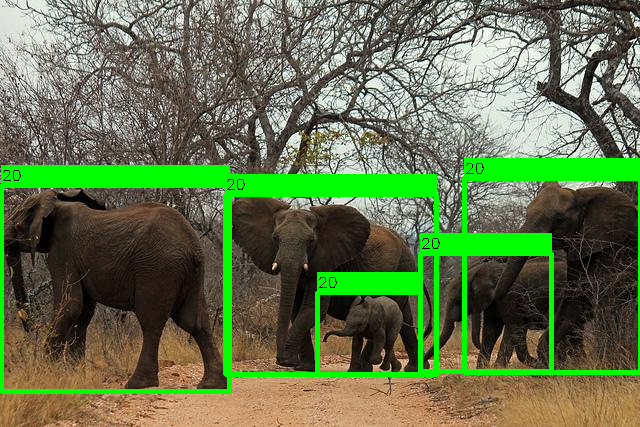

## YOLOv5-Openvino-Cpp-Python

Example of performing inference with ultralytics [YOLOv5](https://github.com/ultralytics/yolov5) using the 2022.1.0 openvino API in C++ using Docker as well as python.

This repository is only for model inference using openvino. Therefore, it assumes the YOLOv5 model is already trained and exported to openvino (.bin, .xml) format. For further info check [YOLOv5](https://github.com/ultralytics/yolov5).

## YOLOv5-Openvino-Cpp
```
cd cpp
```
### Docker installation
This repository folder contains the Dockerfile to build a docker image with the Intel® Distribution of OpenVINO™ toolkit.

1) This command builds an image with OpenVINO™ 2022.1.0 release.
    ```
    docker build . -t openvino_container:2022.1.0
    ```
2) This command creates a docker container with OpenVINO™ 2022.1.0 release.
    ##### Windows
    ```
    docker run -it --rm -v %cd%\..:/yolov5-openvino openvino_container:2022.1.0
    ```
    ##### Linux/Mac
    ```
    docker run -it --rm -v $(pwd)/..:/yolov5-openvino openvino_container:2022.1.0
    ```
### Cmake build

From within the docker run:
```
cd cpp && mkdir build && cd build
```
Then create the make file using cmake:
```
cmake -S ../ -O ./
```
Then compile the program using:
```
make
```
Then run the executable:
```
./main
```

## YOLOv5-Openvino-Python

### Usage
```
cd python
```
```shell
$ python -m venv /path/to/env

Linux/mac
$ source /path/to/env/bin/activate

Windows
$ \path\to\env\Script\activate

$ pip install -r requirements.txt
```

Then run the script:
```
python main.py
```

## Fianl Result:


